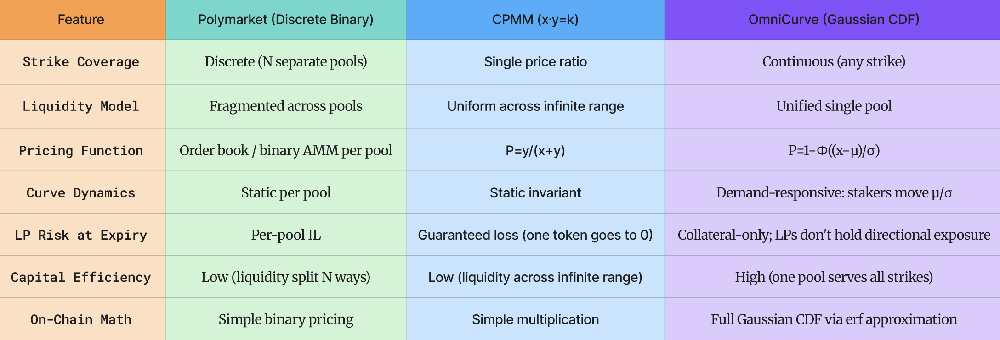
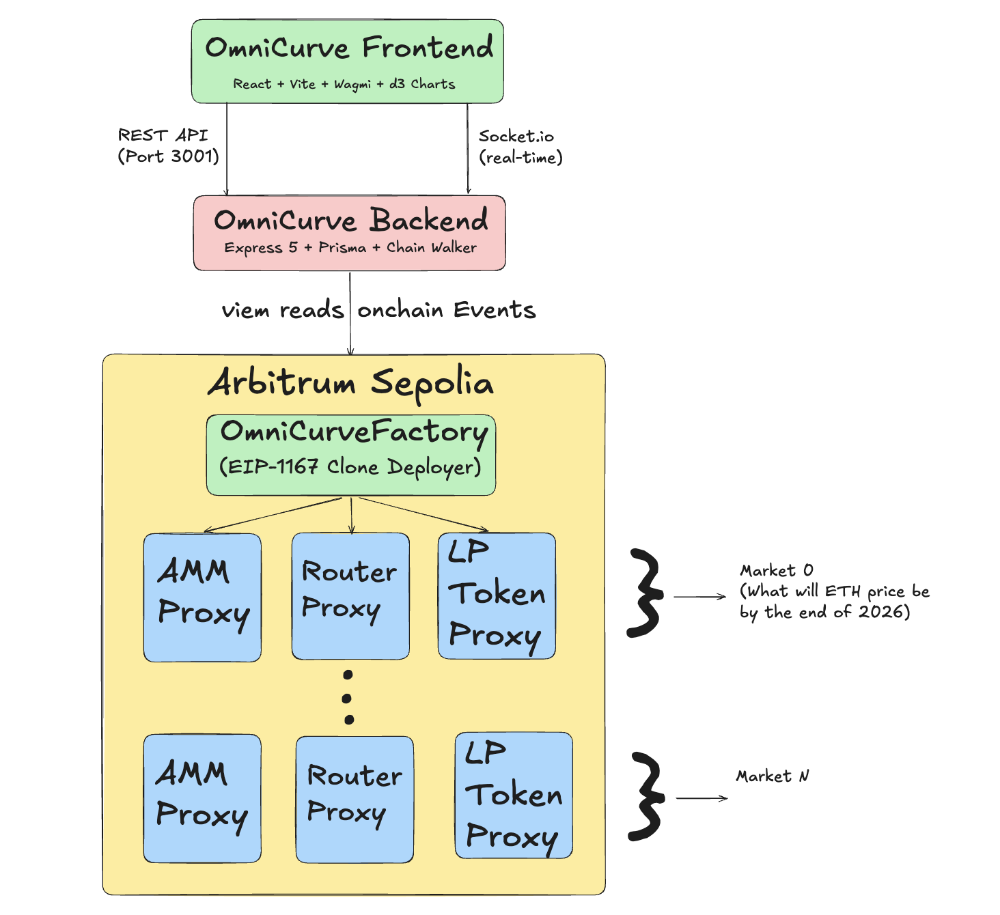
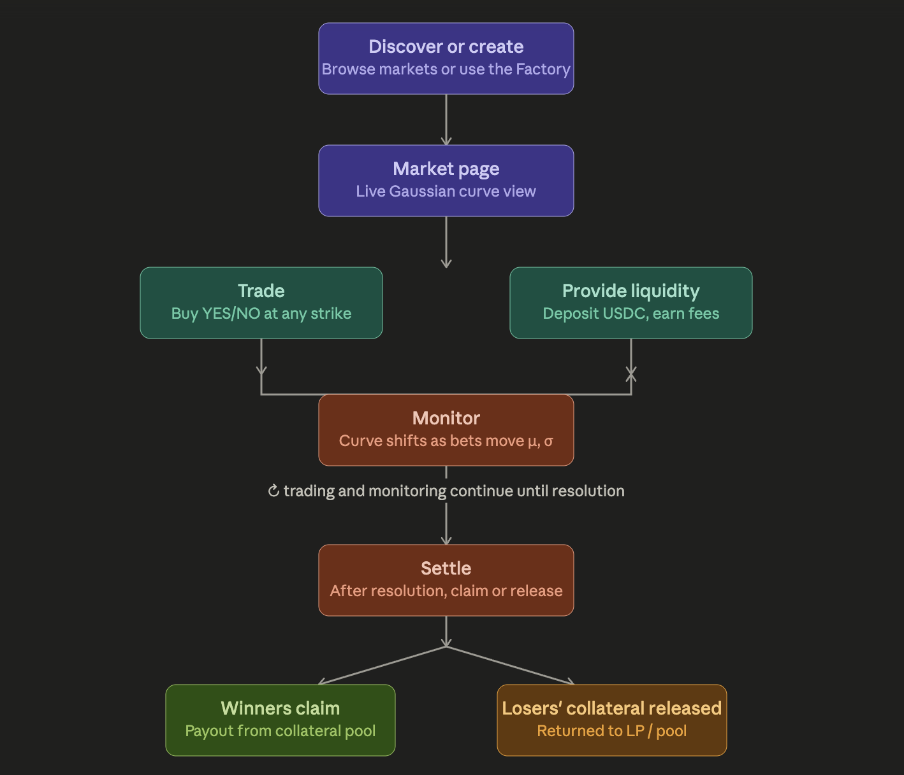
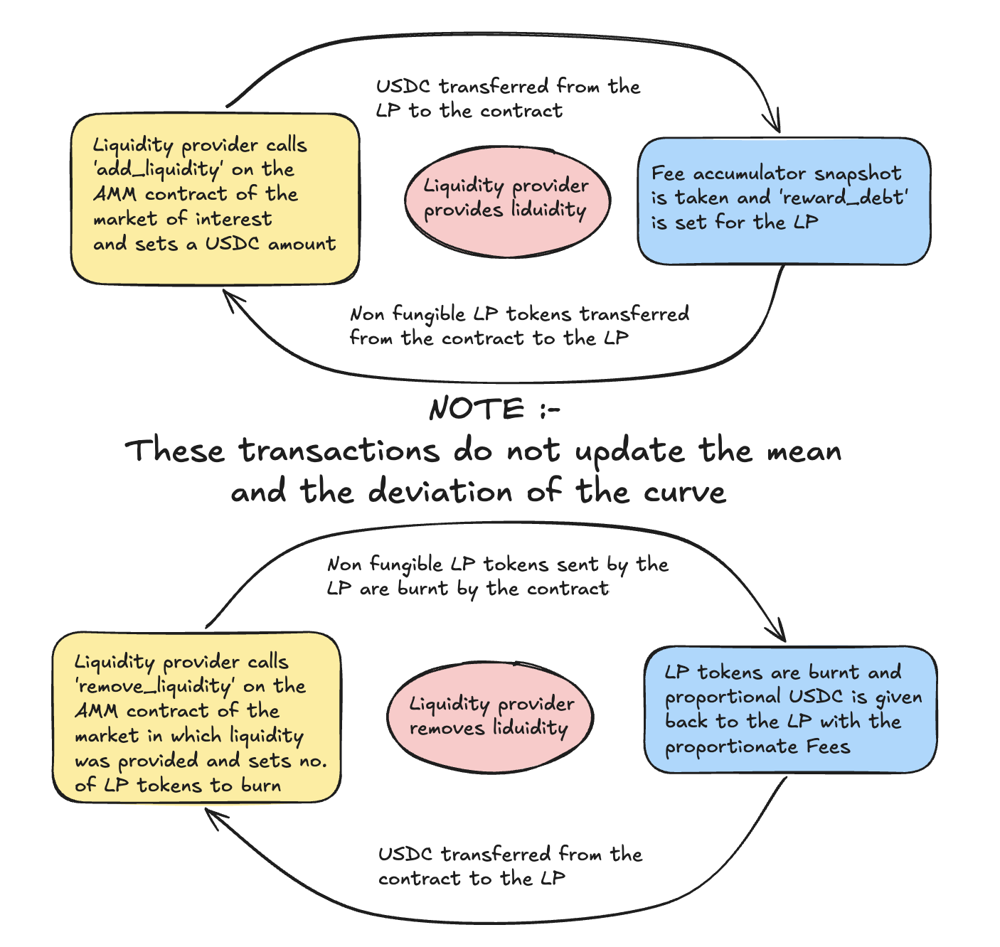

<div align="center">

# 🌊 OmniCurve

### A Unified Continuous Distribution Prediction Market Protocol

**Built on Arbitrum Stylus · Powered by Rust + WASM · Priced by Gaussian Mathematics**

[](https://www.rust-lang.org/)
[](https://docs.arbitrum.io/stylus/gentle-introduction)
[](#10-project-license)
[](https://sepolia.arbiscan.io/)

[](#)
[](#)
[](#)
[](#)

</div>

**OmniCurve** is a novel prediction market protocol built on **Arbitrum Stylus** (Rust compiled to WASM). Instead of fragmenting liquidity across many separate binary "yes/no" pools, OmniCurve collapses all possible outcomes into a **single continuous liquidity curve** — an "omni-curve" — governed by a normal Gaussian probability density function. Our mission is to deliver a capital-efficient, mathematically precise, and demand-responsive platform for the future of prediction markets. This enables users stake value for the many different possible outcomes under a single pool, preventing the liquidity from being fragmented. 

The core of **OmniCurve** translates the continuous Gaussian distribution into a fully on-chain pricing engine using fixed-point WAD arithmetic, an Abramowitz & Stegun error function approximation, and an 18-term Taylor series exponential. It provides a superior alternative to fragmented binary pool designs, which require creating a separate liquidity pool for every strike price. Instead, the users of our markets can bet under the same pool for the strike price of their choide. All of this would have been very tough to implement in native solidity, but the complex mathematical model governing our protocol could be made live on chain for extremely low gas costs, thanks to the **Arbitrum Stylus** which allowed us to use **Rust** as the primary development language which made implementing all of that math so easy. 

## Addresses and the Transaction Hashes

`Factory deployed at:` [0xf6bfadc33c3c42755d9634defbfcc52b8b2d5e24](https://sepolia.arbiscan.io/address/0xf6bfadc33c3c42755d9634defbfcc52b8b2d5e24)

`AMM Implementation:` [0x0d08e6c457bfe0794b258e66c20a788cc8a8fa32](https://sepolia.arbiscan.io/address/0x0d08e6c457bfe0794b258e66c20a788cc8a8fa32)

`Router Implementation:` [0x98846991e02802b20bf947cfe11b4ac6ff463d9f](https://sepolia.arbiscan.io/address/0x98846991e02802b20bf947cfe11b4ac6ff463d9f)

`LP Token Implementation:` [0xce5ce25964af3c917ebca5c972abec94022b868a](https://sepolia.arbiscan.io/address/0xce5ce25964af3c917ebca5c972abec94022b868a) 

`Market #0 {ETH price @ 2026} AMM Proxy:` [0x9736E98CA898Bf69daA126e715Eb639D2DaBFb46](https://sepolia.arbiscan.io/address/0x9736E98CA898Bf69daA126e715Eb639D2DaBFb46)

`Market #0 {ETH price @ 2026} Router Proxy:` [0xA65b5453a177d3C34654Ec4Be60754d0aD7ec6A5](https://sepolia.arbiscan.io/address/0xA65b5453a177d3C34654Ec4Be60754d0aD7ec6A5)

`Market #0 {ETH price @ 2026} LP Token Proxy:` [0x731489Ab2A0029a22a95b5Ea3f72335b18D40CCf](https://sepolia.arbiscan.io/address/0x731489Ab2A0029a22a95b5Ea3f72335b18D40CCf)

## Table of Contents

## Table of Contents

* [1. Overview](#1-overview)
  * [1.1 Introduction](#11-introduction)
  * [1.2 The OmniCurve Solution: Continuous Gaussian Pricing](#12-the-omnicurve-solution-continuous-gaussian-pricing)
  * [1.3 Demand-Responsive Curve Dynamics](#13-demand-responsive-curve-dynamics)
  * [1.4 Settlement Against Reality](#14-settlement-against-reality)
  * [1.5 AMM Model Comparison](#15-amm-model-comparison)
  * [1.6 Conclusion](#16-conclusion)
* [2. Architecture](#2-architecture)
  * [2.1 High-Level Workflow](#21-high-level-workflow)
  * [2.2 Contract System: EIP-1167 Proxy Factory](#22-contract-system-eip-1167-proxy-factory)
  * [2.3 Trade Execution Infrastructure](#23-trade-execution-infrastructure)
  * [2.4 Liquidity Provision Infrastructure](#24-liquidity-provision-infrastructure)
  * [2.5 Fee Distribution Infrastructure](#25-fee-distribution-infrastructure)
  * [2.6 Market Resolution Infrastructure](#26-market-resolution-infrastructure)
  * [2.7 Settlement Infrastructure](#27-settlement-infrastructure)
* [3. Features](#3-features)
* [4. Technical Overview](#4-technical-overview)
* [5. Product roadmap: from hackathon PoC to consumer trading platform](#5-product-roadmap-from-hackathon-poc-to-consumer-trading-platform)
* [6. Contract-by-contract: math meets Rust](#6-contract-by-contract-math-meets-rust)
* [7. Arbitrum Stylus & ecosystem best practices](#7-arbitrum-stylus--ecosystem-best-practices)
* [8. Getting Started](#8-getting-started)
  * [8.1 Prerequisites](#81-prerequisites)
  * [8.2 Installation](#82-installation)
  * [8.3 Building Contracts](#83-building-contracts)
  * [8.4 Running the Backend](#84-running-the-backend)
  * [8.5 Running the Frontend](#85-running-the-frontend)
* [9. Deployment](#9-deployment)
* [10. Project License](#10-project-license)
* [11. References](#11-references)

---

## 1. Overview

**OmniCurve** is a prediction market protocol that replaces the traditional approach of creating many separate binary outcome pools for tracking the same numerical asset with a single, unified continuous liquidity curve derived from the Gaussian (normal) distribution, serving as the base of the distribution markets where people can stake on infinite outcomes. Built on **Arbitrum Stylus** using **Rust** compiled to **WASM**, it performs all pricing mathematics entirely on-chain using **fixed-point arithmetic**.

The platform provides a complete prediction market experience: market creation, continuous-strike trading, liquidity provision and real-time analytics (AMM, Router and LP Tokens)— all powered by a full-stack monorepo spanning smart contracts, a backend API with real-time WebSocket feeds, and a React frontend.

### What led to this project?

Prediction markets have entered popular consciousness in the wake of the 2024 US Presidential elections, but the technology is likely still in its infancy. Further development could be of benefit both to developers and to the public at large. More specifically, today's prediction markets generally allow participants to express probability distributions over discrete outcomes, but many questions of relevance to the real world involve continuous outcomes. It's true that a perp market could elicit the expected value of a continuous variable from the market, but sometimes we would like to know more -- for example, do we know for sure a given project will take 10 years exactly, or could it perhaps be anywhere between 2 and 20? Do we know that a given project will have 10,000 users exactly, or could it be anywhere between 2,000 and 20,000? These questions are important, and today's prediction markets don't allow us to answer them. 


### 1.1 Introduction

#### The problem we solve: 

Existing prediction market platforms like Polymarket create separate binary pools for each possible outcome: "Will ETH be worth $5k by the end of 2026? Yes/No", "Will ETH be worth $5.1k by the end of 2026? Yes/No", and so on. Each strike price needs its own pool, its own liquidity, and its own market makers. This design leads to:

- **Fragmented liquidity**: Capital is spread thinly across many isolated pools
- **Incomplete coverage**: Only a handful of discrete strike prices are offered
- **Inefficient capital deployment**: LPs must choose which specific pool to fund

#### The Nature of Continuous Outcomes

Many real-world prediction questions don't have binary answers — they have a continuous range of possible outcomes. "What will ETH be worth at the end of 2026?" could be $500, $3,000, $10,000, or any value in between. "In what year will OpenAI release it's new model?" could be 2026, 2027, 2028, or any integer value in between. Forcing this continuous outcome space into discrete yes/no buckets is an artificial constraint that wastes capital and limits expressiveness.

#### Many markets tracking a single 

Traditional prediction markets suffer from a fundamental structural inefficiency. Consider a market on ETH's future price:

| Approach | Pools Required | Liquidity per Pool | Coverage |
|----------|---------------|-------------------|----------|
| Currently In markets | N separate pools (one per strike) | Total capital / N | Discrete strikes only |
| **OmniCurve** | **1 unified pool** | **Total capital** | **Any strike price** |

With N separate pools, each pool receives only a fraction of the total liquidity. Traders at less popular strike prices face thin order books, wide spreads, and high slippage. Market makers must actively manage positions across many pools simultaneously.

### 1.2 The OmniCurve Solution: Continuous Gaussian Pricing

OmniCurve replaces discrete pools with a **single continuous Gaussian curve**. The probability of any outcome is derived from the cumulative distribution function (CDF) of a normal distribution:

$$P_{\text{YES}}(x) = 1 - \Phi\left(\frac{x - \mu}{\sigma}\right)$$

$$P_{\text{NO}}(x) = \Phi\left(\frac{x - \mu}{\sigma}\right)$$

Where:
- $x$ is the trader's chosen strike price (any continuous value)
- $\mu$ (mu) is the market's expected value — the consensus belief of all participants
- $\sigma$ (sigma) is the market's uncertainty — how spread out beliefs are
- $\Phi$ is the cumulative distribution function of the standard normal distribution

**Economic intuition:** A YES position at strike $x$ is a bet that the final outcome will be *at or above* $x$. The further $x$ is above the current consensus $\mu$, the less likely this is, and the cheaper the YES token becomes (lower $P_{\text{YES}}$). Conversely, NO tokens become cheaper as $x$ falls further below $\mu$.

#### On-Chain Gaussian Mathematics

The Gaussian CDF is computed entirely on-chain using fixed-point WAD arithmetic (18-decimal precision). The mathematical stack consists of:

- **WAD arithmetic**: `wad_mul(a, b) = a * b / 1e18`, `wad_div(a, b) = a * 1e18 / b`
- **Error function**: Abramowitz & Stegun 5-coefficient polynomial approximation (max error ~1.5 x 10^-7):

$$\text{erf}(x) \approx 1 - (a_1 t + a_2 t^2 + a_3 t^3 + a_4 t^4 + a_5 t^5) e^{-x^2}, \quad t = \frac{1}{1 + px}$$

- **Exponential**: 18-term Taylor series expansion, clamped to [-20, +20] WAD:

$$e^x = \sum_{n=0}^{18} \frac{x^n}{n!}$$

- **Square root**: Newton's method with 128-iteration convergence
- **Gaussian CDF**: Composed from the above primitives as:

$$\Phi(z) = \frac{1}{2}\left(1 + \text{erf}\left(\frac{z}{\sqrt{2}}\right)\right)$$

All functions use I256 (signed 256-bit integer) with 18-decimal fixed-point representation, providing ~11 significant digits of precision.

### 1.3 Demand-Responsive Curve Dynamics

A critical innovation of OmniCurve is that **bettors move the curve, liquidity providers do not**.

The parameters $\mu$ and $\sigma$ are not static — they are a **stake-weighted distribution of all strike prices** bet by traders:

$$\mu = \frac{\sum w_i \cdot x_i}{\sum w_i} \qquad \sigma = \sqrt{\frac{\sum w_i \cdot x_i^2}{\sum w_i} - \mu^2}$$

Where each bet contributes weight $w_i$ (= its net stake in USDC) at strike $x_i$.

This is maintained on-chain via three running accumulators updated on every trade:

| Accumulator | Formula | Purpose |
|:------------|:--------|:--------|
| `acc_stake_weight` | $\sum w_i$ | Total conviction weight |
| `acc_weighted_x` | $\sum w_i \cdot x_i$ | Weighted strike sum (for $\mu$) |
| `acc_weighted_x_sq` | $\sum w_i \cdot x_i^2$ | Weighted strike-squared sum (for $\sigma$) |

**Why LPs cannot move the curve:** Liquidity providers are pure collateral underwriters. If LP deposits could shift $\mu$ and $\sigma$, they would be a free manipulation lever — someone could move the curve without taking any directional risk. By restricting curve movement to bettors who put capital at risk on a position, the protocol is manipulation-resistant by construction.

**The prior weight mechanism:** The market owner seeds an initial $\mu$ and $\sigma$ (a prior belief). This seed is backed by a configurable `prior_weight` of virtual stake (default: 100 WAD), so the first real bet cannot swing the curve to a single point. As more bets accumulate, the prior's influence naturally dilutes.

**Pre-update pricing:** The Router prices each bet against the curve state *before* that bet shifts it, ensuring traders see fair prices that aren't self-referentially affected by their own trade.

### 1.4 Settlement Against Reality

$\mu$ is the market's *belief*, not the boundary it settles on. A market resolves against an externally-observed final price (set manually via the Router's `set_final_price` for this hackathon PoC — no oracle).

Each position is judged against **its own strike**:
- A YES position at strike $X$ pays $1/token if and only if `final_price >= X`
- A NO position at strike $X$ pays $1/token if and only if `final_price < X`

This means a bet that moves $\mu$ around cannot change who wins — settlement is always against the real-world outcome, not the market's consensus.

### 1.5 AMM Model Comparison

The table below compares OmniCurve with the best binary AMMs currently in production, Polymarket and CPMM markets.



### 1.6 Conclusion

OmniCurve represents a paradigm shift in prediction market design: from discrete binary pools to a continuous, unified liquidity curve. By deriving prices from the Gaussian CDF and making the curve demand-responsive (bettors move it, LPs don't), the protocol achieves unified liquidity, continuous pricing, capital efficiency, and manipulation resistance in a single design. The Gaussian mathematics are computed entirely on-chain using Arbitrum Stylus's Rust-to-WASM compilation, enabling sophisticated financial engineering at layer-2 speed and almost no cost as compared to the L1. 

---

## 2. Architecture

The protocol follows a modular architecture with a clear separation between trade execution (Router), liquidity and collateral management (AMM), LP token accounting (LP Token), and market deployment (Factory). The backend provides real-time indexing and a REST + WebSocket API, while the frontend delivers a quantitative-finance-inspired terminal UI.

### 2.1 High-Level Workflow



**User Journey:**



### 2.2 Contract System: EIP-1167 Proxy Factory

The protocol uses an **EIP-1167 minimal proxy (clone) factory pattern**. Implementation contracts are deployed once; the Factory clones them per-market via CREATE2, giving each market its own trio of proxy contracts with independent storage. Since in rust contracts via stylus, CREATE2 cannot be directly implemented, so this is the flow of the function that creates new markets - 

```
OmniCurveFactory.createMarket(usdc, sigma_min)
  ├── deploys AMM Proxy      ──DELEGATECALL──→ AMM Implementation (this is cloned into new instances of AMM proxy)
  ├── deploys Router Proxy   ──DELEGATECALL──→ Router Implementation (this is cloned into new instances of Router Proxy)
  ├── deploys LP Token Proxy ──DELEGATECALL──→ LP Token Implementation (this is cloend into new instances of LP token proxy)
  ├── initializes & wires all three:
  │     AMM ↔ Router (bidirectional)
  │     AMM → LP Token (mint/burn authority)
  │     AMM → USDC token address
  │     AMM → sigma_min floor
  ├── LP Token owner = AMM proxy
  └── transfers AMM + Router ownership to caller (two-step acceptance)
```

**Module Breakdown:**

| Module | Responsibility | Key Functions |
|:-------|:--------------|:-------------|
| `distribution_amm.rs` | Core AMM: liquidity pool, Gaussian params, fee accumulator, collateral custody, curve recomputation | `add_liquidity`, `remove_liquidity`, `underwrite_trade`, `distribute_fee`, `recompute_curve` |
| `binary_router.rs` | Trade execution: CDF pricing, USDC transfers, position bookkeeping, settlement | `buy_yes`, `buy_no`, `set_final_price`, `claim_winnings`, `release_losing_collateral` |
| `factory.rs` | EIP-1167 clone deployer, CREATE2, market registry | `create_market`, `get_market_amm/router/lp_token` |
| `lp_token.rs` | Non-transferable ERC-20 LP receipt token | `mint`, `burn` (AMM-only); `transfer` always reverts |
| `math_core.rs` | On-chain Gaussian math: PDF, CDF, erf, exp, sqrt, WAD arithmetic | `normal_cdf`, `normal_pdf`, `erf_approx`, `exp_wad`, `sqrt_wad` |
| `interfaces.rs` | Cross-contract call interfaces (IERC20, IProxyAmm, etc.) | Solidity-style interface definitions |

### 2.3 Trade Execution Infrastructure

Trading in OmniCurve allows users to express beliefs about continuous outcomes by purchasing YES or NO tokens at any strike price.

**Core Functions:** `buy_yes(target_price, stake_usdc)` and `buy_no(target_price, stake_usdc)` on the Router.

**Execution Flow:**


**Token IDs:** YES = 1, NO = 2

### 2.4 Liquidity Provision Infrastructure

Liquidity providers in OmniCurve are pure collateral underwriters — they fund the pool that pays out winning bets, and earn trading fees in return.

**Core Functions:** `add_liquidity(amount_wad, target_mu, target_sigma)` and `remove_liquidity(shares_to_remove)` on the AMM.

**Key Design: Curve-Neutral Deposits**

Unlike traditional AMMs where LP deposits affect the trading curve, OmniCurve LP deposits are **strictly curve-neutral**. The `target_mu` and `target_sigma` parameters exist for ABI backward compatibility but are ignored — LPs always provide at the current $\mu/\sigma$ and never shift the curve.



### 2.5 Fee Distribution Infrastructure

OmniCurve uses a **MasterChef-style fee accumulator** to distribute trading fees to LPs proportionally without requiring gas-intensive iteration.

**Mechanism:**

- Each trade's 1% fee is sent to the AMM via `distribute_fee`, updating a global accumulator: `acc_fee_per_share`
- Each LP's pending fees = `shares * acc_fee_per_share - reward_debt`
- On deposit, `reward_debt` is set to `shares * acc_fee_per_share` (so new LPs don't claim old fees)
- On withdrawal or `claim_fees`, pending fees are calculated and transferred

This pattern provides O(1) fee distribution regardless of the number of LPs.

### 2.6 Market Resolution Infrastructure

Resolution uses a **two-phase timelock** to provide a dispute window.

**Flow:**

1. **Propose:** Owner calls `propose_resolution(winning_id)` — starts a 24-hour timer
2. **Wait:** Anyone can inspect the proposal during the 24h window; owner can `cancel_resolution`
3. **Execute:** After the timer expires, `execute_resolution()` finalizes the market
4. The market's `is_resolved` flag is set, disabling further trading and liquidity operations

### 2.7 Settlement Infrastructure

After resolution, participants settle positions through a **pull-based claiming** model.

**For Winners:**

- `claim_winnings(target_x, is_yes)` on the Router
- A YES position at strike $X$ wins if `final_price >= X`; a NO position wins if `final_price < X`
- Winning tokens are burned, and USDC is paid out from the AMM's collateral pool

**For Losing Positions:**

- `release_losing_collateral(target_x, is_yes)` — permissionless
- Frees LP collateral that was locked against a position that lost
- Returns the collateral to the available liquidity pool for LP withdrawal

---

## 3. Features

- **Unified Continuous Liquidity:** One pool serves all strike prices — no liquidity fragmentation. Any continuous strike price gets an instant, mathematically derived price from the Gaussian CDF.

- **Demand-Responsive Curve:** $\mu$ and $\sigma$ are stake-weighted aggregates of all bets. The curve tracks collective market belief and requires capital at risk to move — manipulation-resistant by construction.

- **Curve-Neutral LP Deposits:** Liquidity providers are pure collateral underwriters. Their deposits never shift the curve, preventing free manipulation via liquidity.

- **On-Chain Gaussian Mathematics:** Full CDF/PDF computation on-chain using Abramowitz & Stegun erf approximation, 18-term Taylor series exponential, and Newton's method square root — all in 18-decimal fixed-point WAD arithmetic (~11 significant digits).

- **EIP-1167 Proxy Factory:** Deploy unlimited markets from singleton implementations via CREATE2 clones. Each market gets its own isolated storage with shared, gas-efficient implementation code.

- **MasterChef Fee Distribution:** Trading fees (1% per trade) distributed to LPs proportionally via a global accumulator — O(1) gas regardless of LP count.

- **Non-Transferable LP Positions:** LP tokens cannot be traded, simplifying fee accounting and preventing LP position speculation.

- **Two-Phase Resolution with Timelock:** 24-hour dispute window between proposal and execution for market resolution.

- **Real-Time Backend:** Express 5 + Socket.io server watches on-chain events, maintains a PostgreSQL database via Prisma, and broadcasts live curve updates to connected frontends.

- **Quantitative Terminal UI:** React + Vite frontend with d3-powered Gaussian curve visualization, live ETH spot price overlay, and a "signal/noise" design aesthetic inspired by quantitative finance terminals.

---

## 4. Technical Overview

| Layer | Technology |
|-------|------------|
| Smart Contracts | Rust (`#![no_std]`), Arbitrum Stylus SDK v0.10.7, compiled to `wasm32-unknown-unknown` |
| Monorepo | pnpm workspaces |
| Backend API | Node.js, TypeScript, Express 5, Socket.io |
| Database | Prisma ORM + PostgreSQL |
| Indexer | Goldsky subgraph (from-ABI deployment), GraphQL |
| Frontend | React + TypeScript + Vite + Tailwind + Wagmi/Viem + d3 |
| Shared Types | TypeScript package with ABI exports |
| Deployment | Arbitrum Sepolia testnet |

## 5. Product roadmap: from hackathon PoC to consumer trading platform
 
This section reframes OmniCurve as a long-term consumer product rather than a one-shot
hackathon submission — what's solid enough to build on today, and the roadmap for
turning a mathematically rigorous AMM into a trading experience people actually want to
use daily, including a forward bet on AI agents and agentic commerce as a primary
distribution channel for prediction markets.
 
### 5.1 What's live today
 
The hackathon build is a complete, working vertical slice — not a demo with mocked
pieces. Concretely, the following are implemented and deployed on Arbitrum Sepolia:
 
- **The full Gaussian pricing engine on-chain** — `normal_cdf`, `erf_approx`, `exp_wad`,
  `sqrt_wad`, all in fixed-point WAD arithmetic, unit-tested to ~11 significant digits
  against reference values (Sections 2-3).
- **Demand-responsive curve dynamics** — the stake-weighted μ/σ accumulator update,
  prior seeding, and pre-update pricing guarantee (Section 2.2, 3.3).
- **Per-strike ERC-1155 positions** — any `(strike, YES/NO)` pair gets a deterministic
  `keccak256`-derived token ID, minted lazily on first trade. No enumeration of "markets"
  needed.
- **Curve-neutral liquidity provisioning** with MasterChef-style O(1) fee distribution
  to LPs, and non-transferable LP receipt tokens that keep `reward_debt` accounting
  sound.
- **A two-phase resolution timelock** (24h dispute window) plus pull-based claiming for
  both winners (`claim_winnings`) and LPs whose collateral was locked against losing
  positions (`release_losing_collateral`).
- **EIP-1167 factory** that clones AMM/Router/LP-token implementations per market via
  CREATE2, with two-step ownership handoff to the market creator.
- **A real-time backend and frontend** — Express/Socket.io indexer off a Goldsky
  subgraph, Prisma/Postgres persistence, and a React/d3 terminal UI showing the live
  curve.
In short: the *hard part* — getting rigorous, demand-responsive Gaussian pricing to run
cheaply and correctly on-chain — is done. Everything in 6.2 and 6.3 is about the layers
*around* that core: how people discover, enter, and exit positions, and who (or what)
places the trades.
 
### 5.2 Trading experience roadmap
 
The current trading flow (`buy_yes(target_price, stake_usdc)` / `buy_no(...)`, manual
`set_final_price`, pull-based claims) is correct but minimal — a power user's flow, not a
consumer one. Planned improvements, roughly in order of how directly they touch the
existing contracts:
 
- **Oracle-based resolution.** Replace the owner-set `set_final_price` with a Chainlink
  price feed or UMA optimistic-oracle integration. This is the single highest-priority
  change for trust — "the operator decides who wins" is acceptable for a hackathon PoC
  and unacceptable for a product handling real capital. The two-phase timelock
  (`propose_resolution` / `execute_resolution`) is already structured to slot an oracle
  read in place of the manual `winning_id`.
- **Limit and conditional orders.** Today every trade executes immediately at the
  current CDF price. A natural extension: an off-chain order book / intent layer where
  users specify "buy YES at strike $X if the implied price drops below $0.30," matched
  off-chain and settled through `buy_internal` only when the condition is met — similar
  to how many perp DEXs separate intent expression from on-chain execution.
- **Multi-strike position management ("baskets").** Since every `(strike, direction)` is
  its own ERC-1155 token, a natural UX layer is letting a user express a *view on the
  shape of the distribution* — e.g. "I think the curve should be narrower than the
  market currently implies" — as a single basket order that buys/sells across several
  strikes in one transaction (a Router-level batching function, not a math change).
- **Multi-asset collateral.** Currently every market is denominated in a single USDC
  pool (`usdc_token` set per-AMM at creation). Supporting additional collateral types
  (other stables, or yield-bearing assets like USDC-denominated vaults) would let LPs
  earn baseline yield on idle `available_liquidity` between trades — a meaningful
  capital-efficiency unlock given that, structurally, most of the pool sits unused at
  any given strike.
- **Curve analytics and "market microstructure" tooling.** The frontend already plots
  μ/σ live; the roadmap extends this to historical curve replay, per-strike implied
  volatility (derivable from `normal_pdf`, which is implemented but currently unused —
  see Section 3.1), and slippage previews via `get_price_for_x` before a trade is signed.
- **Mobile-first redesign.** The current "quant terminal" aesthetic is intentionally
  power-user-facing. A consumer mobile app would foreground a small number of curated
  markets, simple "thermometer" visualizations of the current belief curve instead of
  raw Gaussian plots, push notifications on resolution and large curve moves, and
  one-tap position sizing.
### 5.3 AI agents and agentic commerce
 
This is the part of the roadmap that's less "finish the AMM" and more "rethink who the
AMM's counterparty is." A continuous, mathematically well-defined pricing curve — one
that returns a price for *any* strike via a single `normal_cdf` call — is unusually
well-suited to being queried and acted on by autonomous agents, for a simple reason:
agents need machine-readable, composable price functions, not "go look at an order book
and eyeball the spread." OmniCurve's `get_price_for_x(x, is_yes)` is already exactly
that.
 
- **Natural-language trading agents.** A conversational interface ("I think ETH ends
  2026 between $4,000 and $6,000, put $50 on that") that decomposes a stated belief into
  a basket of `buy_yes`/`buy_no` calls across strikes — effectively letting a user
  express a *distribution* in plain language and having an agent translate it into the
  position basket from 6.2. This is a thin layer over existing Router calls plus an LLM
  that maps natural-language probability statements to (strike, stake) pairs.
- **Autonomous market-making / LP agents.** Because LP deposits are strictly
  curve-neutral (Section 2.2) and curve health is fully observable on-chain
  (`global_mu`, `global_sigma`, `available_liquidity`, `locked_collateral`), an agent
  could manage LP capital across *multiple* OmniCurve markets — entering/exiting based
  on fee accrual rate (`acc_fee_per_share`), pool utilization
  (`locked_collateral / (locked_collateral + available_liquidity)`), and `sigma_min`
  proximity (a market whose σ is pinned at the floor is signaling either very strong
  consensus or insufficient real activity) — without ever needing permission to move the
  curve, since LP deposits structurally can't.
- **Belief-aware portfolio agents.** An agent that holds a calibrated forecast for an
  underlying (e.g. from an external model or aggregated data) could continuously compare
  its own implied (μ, σ) against the market's current `global_mu`/`global_sigma` and
  size positions proportional to the *divergence* — essentially an automated "trade
  against the consensus when you have a better-calibrated prior" strategy, which is a
  natural fit for OmniCurve specifically because the market's belief is *itself* a
  Gaussian (μ, σ) that's directly comparable to an agent's own forecast distribution, not
  a discrete probability that needs reinterpretation.
- **Agent-to-agent settlement and agentic commerce rails.** As agent-native payment
  protocols mature (e.g. x402-style HTTP-native micropayments, or Arbitrum-native
  account-abstraction wallets for agents), OmniCurve's pull-based claim model
  (`claim_winnings`, `release_losing_collateral`) is already permissionless and
  stateless enough to be called by an agent's wallet without any bespoke integration —
  the roadmap item here is less "change the contracts" and more "make sure the
  Router/AMM ABI is documented and stable enough that agent frameworks can integrate
  against it as a standard primitive," plus building reference agent SDKs (TypeScript
  and Python) wrapping the existing `IDistributionAmm`/Router interfaces.
- **Agent-readable market metadata and discovery.** For agents to *find* relevant
  markets (not just trade ones they're told about), the backend's REST/GraphQL layer
  would need a standardized, machine-readable schema describing each market's question,
  current (μ, σ), resolution criteria, and time-to-resolution — effectively an
  "llms.txt for prediction markets" that lets an agent enumerate tradeable beliefs across
  many OmniCurve markets and reason about which ones are relevant to whatever task it's
  performing.
### 5.4 Sequencing and dependencies
 
Roughly: **oracle resolution** unblocks everything else, since no serious capital (human
or agent) should be staked against a manually-resolved market. **Multi-strike
baskets and `get_price_for_x`-based previews** are the shared infrastructure that both
the consumer UX (6.2) and the natural-language/portfolio agents (6.3) build on — so
basket-order support at the Router level is the highest-leverage near-term contract
change. **Agent SDKs and metadata schemas** can be built in parallel with the UX work
since they consume the same read-only surface (`global_mu`, `global_sigma`,
`get_price_for_x`, `acc_fee_per_share`) that already exists today.

## 6. Contract-by-contract: math meets Rust
 
### 6.1 `math_core.rs` — the numerical kernel
 
This module has zero contract state and zero external calls — it is pure functions over
`I256`, which is exactly what makes it cheap to call from both `distribution_amm.rs` and
`binary_router.rs` (and trivial to unit-test off-chain with `cargo test`, as the 9 tests
at the bottom of the file do).
 
| Formula | Function | Notes |
|---|---|---|
| `wad_mul(a,b) = a*b/1e18`, `wad_div(a,b) = a*1e18/b` | `wad_mul`, `wad_div` | All other functions are built from these two; `wad_div` returns `0` on divide-by-zero rather than panicking, which matters because Stylus has no exception unwinding for arithmetic panics inside `no_std` — a panic there would burn the whole call's gas |
| `e^x = sum_{n=0}^{18} x^n/n!` | `exp_wad` | Iterative term update (`term = wad_mul(term, x) / n`) avoids recomputing `x^n` and `n!` from scratch each iteration — O(1) per term instead of O(n) |
| `erf(x) ~ 1 - poly(t)*e^{-x^2}`, `t = 1/(1+px)` | `erf_approx` | Handles sign separately (`erf` is odd) so the polynomial only needs to be evaluated for `x >= 0` |
| `Phi(z) = (1 + erf(z/sqrt2))/2` | `normal_cdf` | Guards `sigma <= 0` up front — a degenerate distribution returns `0` rather than dividing by zero |
| `phi(z) = e^{-z^2/2} / (sigma*sqrt(2*pi))` | `normal_pdf` | Currently unused by the AMM/Router (which only need the CDF for pricing) but exposed for potential future use (e.g. marginal-price / slippage estimates) |
| Newton's method `sqrt` | `sqrt_wad` | Uses `x` itself as the initial guess when `x > 1e18`, which is a much better starting point than `x * 1e18` for large values and avoids needless iterations |
| `I256 -> U256` | `safe_to_u256` | Asserts non-negativity rather than reinterpreting two's-complement bits — a defense-in-depth check against a negative CDF/variance ever silently becoming an enormous unsigned number |
 
**A subtle but important design choice:** `wad_mul` and `wad_div` use plain `*` / `/` on
`I256` rather than checked arithmetic. In a `#![no_std]` Stylus contract, an arithmetic
overflow panic aborts the entire transaction with no revert message and burns remaining
gas — so every caller of these functions is implicitly relying on the fact that WAD
values here are bounded (prices and CDFs in `[0, 1e18]`, strikes/sigmas in realistic
ranges, intermediate products inside `I256`'s ~1.16e77 range). The `exp_wad` clamp to
`[-20, 20]` and the `clamp_unit` calls in `normal_pdf`/`normal_cdf` are precisely the
guardrails that keep values inside this safe envelope before they reach `wad_mul`.
 
### 6.2 `distribution_amm.rs` — curve state and collateral
 
This contract owns the three accumulators from Section 2.2 and is the *only* place
`recompute_curve` is called from.
 
**`set_distribution(mu, sigma)`** — owner-only, pre-trading. Implements the prior-seeding
identity directly:
 
```rust
let pw = if self.prior_weight.get() <= I256::ZERO { default_prior_weight() } else { self.prior_weight.get() };
let ex2 = wad_mul(mu, mu) + wad_mul(sigma, sigma);   // E[x^2] = mu^2 + sigma^2
self.acc_stake_weight.set(pw);
self.acc_weighted_x.set(wad_mul(pw, mu));            // Sw*x = pw * mu
self.acc_weighted_x_sq.set(wad_mul(pw, ex2));        // Sw*x^2 = pw * (mu^2 + sigma^2)
```
 
This is the exact `Sigma w x <- w_prior * mu0`, `Sigma w x^2 <- w_prior*(mu0^2+sigma0^2)`
seeding from Section 2.2 — reconstructing mu/sigma from these three numbers via
`recompute_curve` reproduces `(mu0, sigma0)` exactly, by construction. The function also
guards `sigma <= sigma_min` (variance floor) and `trades_started` (the prior can't be
re-seeded once real bets exist — `set_prior_weight` has the same guard).
 
**`recompute_curve`** (private, called at the end of every `underwrite_trade`) is
Section 2.2's formulas verbatim:
 
```rust
let mu = wad_div(self.acc_weighted_x.get(), total_weight);          // mu = Swx / Sw
let ex2 = wad_div(self.acc_weighted_x_sq.get(), total_weight);      // E[x^2] = Swx2 / Sw
let variance = ex2 - wad_mul(mu, mu);                                // Var = E[x^2] - mu^2
let mut sigma = if variance > I256::ZERO { sqrt_wad(variance) } else { I256::ZERO };
if sigma < self.sigma_min.get() { sigma = self.sigma_min.get(); }    // sigma floor
```
 
The `variance > 0` guard before calling `sqrt_wad` is necessary because fixed-point
rounding in `wad_div`/`wad_mul` can occasionally produce a `variance` that is a tiny
negative number even when the true variance is `~0` — `sqrt_wad` is only defined for
non-negative inputs (it returns `0` for `x <= 0`), so this avoids feeding it a spurious
negative and instead floors directly to `sigma_min`.
 
**`underwrite_trade`** — the only function that updates the accumulators, and only when
`weight = premium_i256 > 0` (i.e. only real bets, never zero-stake calls):
 
```rust
self.acc_stake_weight.set(self.acc_stake_weight.get() + weight);
self.acc_weighted_x.set(self.acc_weighted_x.get() + wad_mul(weight, target_x));
self.acc_weighted_x_sq.set(self.acc_weighted_x_sq.get() + wad_mul(weight, x_sq));
self.recompute_curve();
```
 
This is `Sigma w <- Sigma w + w_i`, `Sigma w x <- Sigma w x + w_i*x_i`, `Sigma w x^2 <-
Sigma w x^2 + w_i*x_i^2` — an O(1) running update, no loop over historical bets. Note
also the **collateral accounting** that happens in the same call, independent of the
curve math: `available_liquidity += premium - liability` and `locked_collateral +=
liability`. This is what makes `underwrite_trade` the single atomic point where "a bet
was placed" simultaneously (a) reserves the worst-case payout from the LP pool and (b)
updates the market's belief — a clean separation of *solvency* bookkeeping from *pricing*
bookkeeping, both inside one state transition.
 
**`get_price_for_x`** is the read-only mirror of the Router's pricing logic — `1 -
normal_cdf(x, mu, sigma)` for YES, `normal_cdf(x, mu, sigma)` for NO — exposed so the
frontend/backend can preview prices for arbitrary strikes without simulating a trade.
 
**Fee distribution (`distribute_fee` / `claim_fees_internal`)** is the MasterChef pattern
— not Gaussian math, but worth noting because it's the other piece of "rigorous"
accounting in this contract: `acc_fee_per_share += fee * 1e18 / total_shares`, and each
LP's claimable amount is `shares * acc_fee_per_share / 1e18 - reward_debt`. This is O(1)
regardless of LP count, the standard SushiSwap MasterChef trick.
 
### 6.3 `binary_router.rs` — pricing and trade execution
 
**`buy_internal`** is where Section 2.1's pricing formula is actually evaluated against
live state, and where the **pre-update pricing** guarantee from the README is enforced
by *call ordering*:
 
```rust
let mu = amm.global_mu(self.vm(), config_mu).map_err(...)?;       // 1. read curve BEFORE this trade
let sigma = amm.global_sigma(self.vm(), config_sigma).map_err(...)?;
let p_no = normal_cdf(target_price, mu, sigma);                     // 2. price off that pre-trade curve
let price = if is_yes { wad() - p_no } else { p_no };               // P_YES = 1 - Phi(z), P_NO = Phi(z)
...
amm.underwrite_trade(self.vm(), config_trade, token_id, target_price, net_stake_wad, tokens_minted_wad)?;  // 3. THEN update the curve
```
 
Because steps 1-2 (price computation) happen via `Call::new()` (read-only) *before* step
3 (`Call::new_mutating`, which triggers `recompute_curve`), a trader's own bet cannot
retroactively cheapen or inflate the price they pay — the price they see is the price
the AMM had the instant before their trade landed. This single ordering constraint is
the entire on-chain enforcement mechanism for "pre-update pricing."
 
**Token sizing** implements `tokens = net_stake / price` in WAD terms:
 
```rust
let fee_wad = stake_wad / 100;                    // 1% fee
let net_stake_wad = stake_wad - fee_wad;
let tokens_minted_wad = (net_stake_wad * 1e18) / price_u256;   // tokens = net_stake / price
```
 
Because `price in (0, 1]` (WAD), `tokens_minted >= net_stake` always — a token that costs
$0.20 yields 5 tokens per $1 of net stake, each worth $1 if it wins, so the AMM's maximum
liability for this position is `tokens_minted * $1`, which is exactly the
`max_liability_wad` passed into `underwrite_trade`. The `price_u256 == 0` guard before
this division is the hard backstop against the CDF ever returning exactly zero (which
would only happen at `z -> -infinity`, i.e. an absurdly extreme strike relative to
sigma).
 
**Settlement** (`claim_winnings_internal`) applies Section 1.4's rule directly —
`final_price >= target_x` for YES, `final_price < target_x` for NO — and pays exactly `1
USDC` per WAD-token (`user_balance / 1e12`), which is the $1-per-winning-token
normalization that complementarity (`P_YES + P_NO = 1`) was designed to support: every
token, regardless of its strike, redeems at the same fixed $1, so the AMM's total
liability across all strikes is just `sum of winning token supplies`, independent of how
spread out those strikes were.
 
**Token identity** (`derive_token_id`) is `keccak256(market_id || target_x || is_yes)` —
a content-addressed ID for the continuum of (strike, direction) pairs. This is the
on-chain analogue of "infinite strikes, one pool": there is no enumerable list of
markets-within-the-market; any `(x, is_yes)` a trader chooses deterministically hashes to
its own ERC-1155 token ID, created lazily on first use.
 
### 6.4 `factory.rs` — EIP-1167 clones via Stylus
 
This module is the one piece of the system with no Gaussian math at all, but it has the
most Stylus-specific engineering, since **CREATE2 is not directly exposed by the Stylus
SDK** the way Solidity's `create2` opcode is.
 
**The 55-byte creation code (`build_eip1167_creation_code`)** is hand-assembled raw EVM
bytecode matching OpenZeppelin's `Clones.sol` byte-for-byte:
 
- `3d602d80600a3d3981f3` (10 bytes) — init code that copies the 45-byte runtime to
  memory and returns it as the deployed bytecode
- `363d3d373d3d3d363d73` + `<20-byte implementation address>` (30 bytes) — runtime
  prefix that copies calldata into memory
- `5af43d82803e903d91602b57fd5bf3` (15 bytes) — the `DELEGATECALL` and
  return/revert-bubbling suffix
This is the *exact* minimal-proxy pattern from EIP-1167 — every market's AMM, Router, and
LP Token proxy is a 45-byte runtime that `DELEGATECALL`s into one shared implementation,
so adding a new market costs roughly 3 x 45 bytes of new code plus storage
initialization, not 3 x (full contract bytecode).
 
**`market_salt(market_id, domain)`** packs the market ID into the first 31 bytes of a
`B256` salt and a single domain tag byte (`0` = AMM, `1` = Router, `2` = LP Token) into
the last byte. This guarantees the three proxies for a given market land at three
*different*, deterministically-derivable addresses, while still being a pure function of
`(market_id, domain)` — useful for off-chain tooling (the backend/indexer) that wants to
predict a market's addresses before `create_market` is even mined.
 
**`RawDeploy::new().salt(salt).deploy(vm, &bytecode, U256::ZERO)`** is the Stylus SDK's
`unsafe` low-level deploy primitive — `unsafe` because the SDK cannot statically verify
that `bytecode` is well-formed EVM bytecode (unlike normal Stylus contract deployment,
which goes through WASM validation). This is the price of doing CREATE2 from inside a
Stylus contract: there's no high-level "deploy this Rust struct as a clone" API, so the
factory drops to raw bytecode assembly, the same primitive a Solidity contract calling
the EVM `CREATE2` opcode directly would use.
 
**Initialize-then-wire-then-handoff** is the sequence the diagram shows: the factory is
briefly the `owner` of all three freshly-deployed proxies (so it alone can call
`set_router_address`, `set_lp_token`, `set_usdc_token`, `set_sigma_min`,
`set_amm_address`, `set_market_id`), and only *after* all six wiring calls succeed does
it call `transfer_ownership(creator)` on the AMM and Router (LP Token's owner is
permanently the AMM proxy, by design — only the AMM can `mint`/`burn` LP shares). The
two-step ownership transfer (`transfer_ownership` + `accept_ownership`) is the standard
OpenZeppelin `Ownable2Step` pattern, reimplemented manually since Stylus doesn't ship
inheritable contract mixins the way Solidity's OpenZeppelin does.
 
### 6.5 `lp_token.rs` — accounting primitive, deliberately incomplete ERC-20
 
The LP token is an ERC-20-shaped contract with `transfer` and `transferFrom` hardcoded to
`Err(Error::Unauthorized)` — this is intentional, not a bug. Section 1's
manipulation-resistance argument depends on `add_liquidity`/`remove_liquidity` being the
*only* way LP share balances change (so that `claim_fees_internal`'s `reward_debt`
bookkeeping in `distribution_amm.rs` always sees a balance that moved only through
`mint`/`burn`, both of which immediately update `reward_debt`). A transferable LP token
would let shares move between addresses without going through `add_liquidity_internal` /
`remove_liquidity_internal`, silently desyncing `reward_debt` from `balance_of` and
letting a buyer of "used" LP tokens claim fees they didn't earn (or a seller forfeit fees
they did). Making the token explicitly non-transferable closes this off at the type
level rather than relying on the AMM to police it.
 
`mint`/`burn` are restricted to `msg_sender() == owner` (the AMM proxy, set once at
`initialize` time by the factory) — this is the cross-contract authorization edge in the
diagram above (`AMM -> LP token: mint/burn authority`).
 
---
 
## 7. Arbitrum Stylus & ecosystem best practices
 
OmniCurve's central pitch is "math that would be prohibitively expensive (or simply
impractical) in Solidity becomes cheap in Stylus." The codebase backs this up with
several concrete patterns worth calling out:
 
**Why Stylus for this specific math.** An 18-term Taylor series, a 5-term rational erf
approximation, and a 128-iteration Newton's method square root are, combined, on the
order of 150-200 arithmetic operations *per CDF evaluation*, and `normal_cdf` /
`recompute_curve` run on every single trade. In the EVM interpreter, each `MUL`/`DIV` on
a 256-bit word costs a fixed 5 gas regardless of the actual computation, but the
*dispatch overhead* of an interpreted bytecode loop dominates for tight numerical loops.
Stylus compiles this Rust to WASM, which is executed by a near-native WASM runtime —
the same Newton's-method loop that would cost tens of thousands of gas as hand-rolled
EVM bytecode runs as compiled machine instructions, which is the entire reason the
README can claim this is viable on every trade rather than only at market-creation time.
 
**`I256` over floating point.** There is no floating point in `no_std` Stylus (and no
floating point in the EVM at all) — every primitive in `math_core.rs` operates on
`alloy_primitives::I256`, Alloy's 256-bit signed integer, with WAD (1e18) fixed-point
scaling. This is the same convention used by Solidity DeFi (Uniswap, Compound, etc.), so
the `wad_mul`/`wad_div` helpers are a drop-in mental model for anyone coming from
Solidity, while the actual arithmetic runs as native `i256` operations in WASM.
 
**Reentrancy guards are explicit, not inherited.** Every state-mutating, fund-moving
function (`claim_fees`, `add_liquidity`, `remove_liquidity`, `payout_winnings`,
`sweep_dust` in the AMM; `claim_winnings` in the Router) follows the same
`if self.locked.get() { return Err(...) } self.locked.set(true); ...; self.locked.set(false);`
pattern. Stylus's `sol_storage!` macro doesn't provide an OpenZeppelin-style
`nonReentrant` modifier out of the box, so this is hand-rolled — but it's applied
*consistently* across both contracts, which is the property that matters more than the
mechanism.
 
**Cross-contract calls via `sol_interface!`.** `interfaces.rs` defines `IERC20`,
`IProxyAmm`, `IProxyRouter`, `ILpToken` using the `sol_interface!` macro, which generates
typed Rust bindings that ABI-encode/decode exactly as a Solidity contract would expect.
This is what lets the Stylus AMM proxy call `usdc.transfer_from(...)` against an ordinary
Solidity ERC-20 (the deployed USDC mock), and what lets `binary_router.rs` call
`IDistributionAmm::new(amm_address).global_mu(...)` against the AMM proxy — Stylus
contracts and Solidity contracts are ABI-compatible and freely interoperate on Arbitrum,
which is why the factory can clone Stylus implementations using the *Solidity*
EIP-1167 proxy pattern without any special-casing.
 
**`Call::new()` vs `Call::new_mutating(&mut *self)`.** The codebase consistently
distinguishes read-only cross-contract calls (`Call::new()`, used for `global_mu`,
`global_sigma`, `balance_of`) from state-mutating ones (`Call::new_mutating(&mut *self)`,
used for `transfer`, `mint`, `underwrite_trade`). This isn't just style — it's what makes
the "pre-update pricing" guarantee in Section 3.3 visible in the type system: a reviewer
can see, from the call signature alone, that the `global_mu`/`global_sigma` reads in
`buy_internal` cannot have been affected by anything this transaction has done so far.
 
**Feature-gated single-crate, four-binary build.** `main.rs`/`lib.rs` use Cargo feature
flags (`amm`, `router`, `factory`, `lp-token`) to compile *one* crate into *four*
separate WASM binaries, each with only the relevant module included via `#[cfg(...)]`.
This avoids duplicating `math_core.rs` and `interfaces.rs` across four crates while still
producing minimal, single-purpose WASM blobs for deployment — each contract pays gas
only for the code paths it actually contains.
 
**Defense-in-depth on type conversions.** `safe_to_u256` (used everywhere a WAD `I256`
price, variance, or balance needs to become a `U256` for a token transfer) explicitly
asserts non-negativity rather than relying on `U256::from(value.into_raw())`, which would
silently reinterpret a negative `I256`'s two's-complement bit pattern as an enormous
positive `U256` — a class of bug that, combined with `clamp_unit`'s guarantee that CDFs
stay in `[0, 1e18]`, makes "negative price becomes near-infinite USDC transfer" an
unreachable state by construction in two independent ways (clamping at the math layer,
asserting at the conversion layer).
 
**Two-phase resolution with on-chain timelock.** `propose_resolution` /
`cancel_resolution` / `execute_resolution` implement a 24-hour dispute window using
`self.vm().block_timestamp()` directly — no off-chain keeper or oracle dependency for the
*timing* of resolution (only the *final price* itself is owner-supplied, which the
README is upfront about as a hackathon simplification rather than a production design).
 
## 8. Getting Started

Follow these instructions to set up the project locally for development and testing.

### 8.1 Prerequisites

- **Rust** (1.88.0+) with `wasm32-unknown-unknown` target
- **Cargo Stylus CLI** for contract deployment
- **Node.js** (v18+) and **pnpm** for the monorepo
- **PostgreSQL** for the backend database
- **Foundry** (optional, for Solidity-based integration tests)

### 8.2 Installation

Clone the repository and install all workspace dependencies:

```bash
git clone <repository_url>
cd OmniCurve
pnpm install
```

### 8.3 Building Contracts

Each contract is compiled separately using Cargo feature flags, producing four WASM binaries from a single crate:

```bash
cd packages/contracts

# Build each contract
cargo build --target wasm32-unknown-unknown --features amm --release
cargo build --target wasm32-unknown-unknown --features router --release
cargo build --target wasm32-unknown-unknown --features lp-token --release
cargo build --target wasm32-unknown-unknown --features factory --release

# Run math unit tests
cargo test
```

### 8.4 Running the Backend

```bash
# Set up environment variables (see .env.example)
# Required: DATABASE_URL, RPC_URL, contract addresses

# Apply database migrations and seed from on-chain state
pnpm --filter @omnicurve/backend db:migrate
pnpm --filter @omnicurve/backend db:seed

# Start the API server (port 3001)
pnpm --filter @omnicurve/backend start:api
```

### 8.5 Running the Frontend

```bash
# Start the Vite dev server
pnpm --filter @omnicurve/frontend dev
```

The frontend connects to the backend API at `localhost:3001` and to Arbitrum Sepolia via Wagmi/Viem.

---

## 9. Deployment

### Contract Deployment

Deploy implementation contracts as singletons, then use the Factory to create markets:

```bash
RPC_URL="https://sepolia-rollup.arbitrum.io/rpc"
KEY=<PRIVATE_KEY>

# 1. Deploy each implementation contract
cargo stylus deploy --features amm \
  --private-key $KEY --endpoint $RPC_URL --no-verify \
  --wasm-file target/wasm32-unknown-unknown/release/omnicurve_contracts.wasm

cargo stylus deploy --features router \
  --private-key $KEY --endpoint $RPC_URL --no-verify \
  --wasm-file target/wasm32-unknown-unknown/release/omnicurve_contracts.wasm

cargo stylus deploy --features lp-token \
  --private-key $KEY --endpoint $RPC_URL --no-verify \
  --wasm-file target/wasm32-unknown-unknown/release/omnicurve_contracts.wasm

cargo stylus deploy --features factory \
  --private-key $KEY --endpoint $RPC_URL --no-verify \
  --wasm-file target/wasm32-unknown-unknown/release/omnicurve_contracts.wasm

# 2. Initialize the Factory with implementation addresses
cast send <FACTORY> \
  "initialize(address,address,address,address)" \
  <OWNER> <AMM_IMPL> <ROUTER_IMPL> <LP_TOKEN_IMPL> \
  --private-key $KEY --rpc-url $RPC_URL

# 3. Create a market
cast send <FACTORY> \
  "createMarket(address,int256)" \
  <USDC_ADDRESS> <SIGMA_MIN_WAD> \
  --private-key $KEY --rpc-url $RPC_URL

# 4. Accept ownership on AMM and Router proxies
cast send <AMM_PROXY> "acceptOwnership()" --private-key $KEY --rpc-url $RPC_URL
cast send <ROUTER_PROXY> "acceptOwnership()" --private-key $KEY --rpc-url $RPC_URL

# 5. Seed the initial distribution
cast send <AMM_PROXY> "setDistribution(int256,int256)" <MU_WAD> <SIGMA_WAD> \
  --private-key $KEY --rpc-url $RPC_URL
```

### Deployed Addresses (Arbitrum Sepolia)

| Contract | Address |
|----------|---------|
| AMM Implementation | `0x0d08e6c457bfe0794b258e66c20a788cc8a8fa32` |
| Router Implementation | `0x98846991e02802b20bf947cfe11b4ac6ff463d9f` |
| LP Token Implementation | `0xce5ce25964af3c917ebca5c972abec94022b868a` |
| Factory | `0xf6bfadc33c3c42755d9634defbfcc52b8b2d5e24` |
| Market #0 AMM Proxy | `0x9736E98CA898Bf69daA126e715Eb639D2DaBFb46` |
| Market #0 Router Proxy | `0xA65b5453a177d3C34654Ec4Be60754d0aD7ec6A5` |
| Market #0 LP Token Proxy | `0x731489Ab2A0029a22a95b5Ea3f72335b18D40CCf` |
| USDC | `0x75faf114eafb1BDbe2F0316DF893fd58CE46AA4d` |

---


## 10. Project License

This project is licensed under the **MIT License**.

---

## 11. References

- **Gaussian Distribution (Normal Distribution):** [Wikipedia — Normal Distribution](https://en.wikipedia.org/wiki/Normal_distribution)
- **Abramowitz & Stegun Error Function Approximation:** Handbook of Mathematical Functions, Formula 7.1.26
- **EIP-1167 Minimal Proxy Standard:** [EIP-1167](https://eips.ethereum.org/EIPS/eip-1167)
- **Arbitrum Stylus Documentation:** [Arbitrum Stylus](https://docs.arbitrum.io/stylus/gentle-introduction)
- **MasterChef Fee Distribution Pattern:** [SushiSwap MasterChef](https://docs.sushi.com/)
- **Distribution Market Design:** [Paradigm Distribution Market Research](https://www.paradigm.xyz/2024/12/distribution-markets)
- **Prediction Market Design:** [Paradigm PM-AMM Research](https://www.paradigm.xyz/2024/11/pm-amm)
